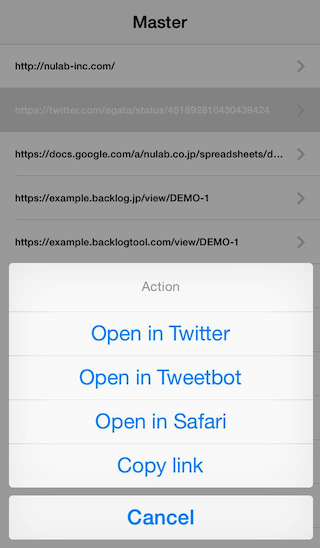

# NLBURLAction
NLBURLAction is a library to open custom scheme URLs easily. It can convert URL to custom scheme URL.



# Used in Production
- [Typetalk](https://itunes.apple.com/en/app/typetalk/id756503889?mt=8)

# Requirements
- iOS 4.3 or later
- ARC

# Usage
Instance `NLBURLAction` and register classes following `NLBURLActionProtocol`.

```objc
NSURL *url = [NSURL URLWithString:@"https://twitter.com/agata/status/451892810430439424"];
NLBURLAction *urlAction = [[NLBURLAction alloc] initWithActionClasses:@[[NLBBacklogURLAction class], [NLBTwitterURLAction class], [NLBTweetbotURLAction class]]];
NSArray *actions = [urlAction arrayURLActionsWithURL:url];

NSLog(@"count=%d", actions.count); // 2
NSLog(@"actions[0]=%@", actions[0]); // NLBTwitterURLAction
NSLog(@"actions[1]=%@", actions[1]); // NLBTweetbotURLAction

NSObject<NLBURLActionProtocol> *action = (NSObject<NLBURLActionProtocol> *)actions[0];
[action doActionURL:url]; // open Tweeter app with URL
```

# Supported Action
## Open in app
- [Backlog](https://backlogtool.com/)
- [Google Drive](https://itunes.apple.com/en/app/google-drive/id507874739?mt=8)
- [Safari](https://www.apple.com/ios/)
- [Twitter](https://itunes.apple.com/en/app/twitter/id333903271?mt=8)
- [Tweetbot](https://itunes.apple.com/en/app/twitter/id333903271?mt=8)
- [Typetalk](https://itunes.apple.com/en/app/typetalk/id756503889?mt=8)
- [Youtube](https://itunes.apple.com/en/app/youtube/id544007664?mt=8)

## Other actions
- [UIPasteboard](https://www.apple.com/ios/) - Copy link

# Install
## CocoaPods

```
pod 'NLBURLAction'
```

# License
[Apache]: http://www.apache.org/licenses/LICENSE-2.0
[MIT]: http://www.opensource.org/licenses/mit-license.php
[GPL]: http://www.gnu.org/licenses/gpl.html
[BSD]: http://opensource.org/licenses/bsd-license.php
[MIT license][MIT].
